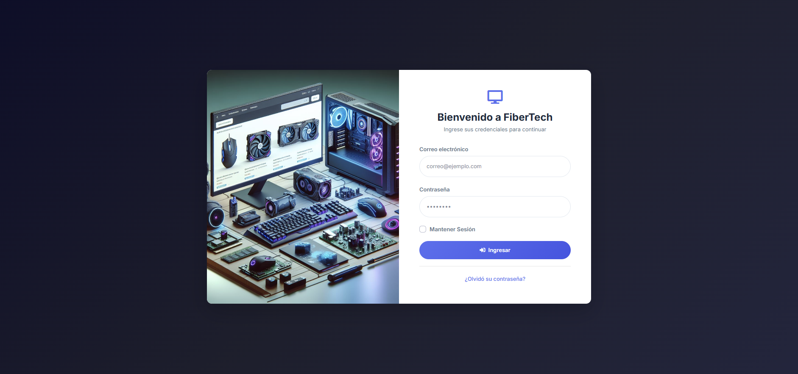
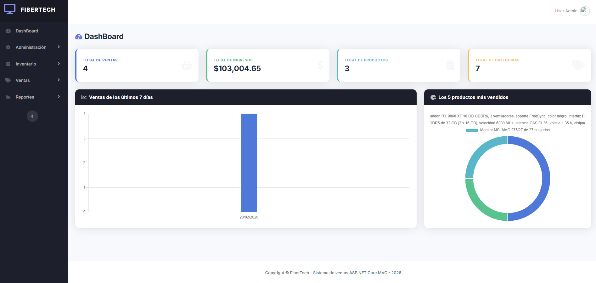
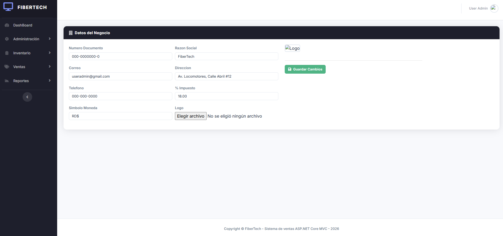
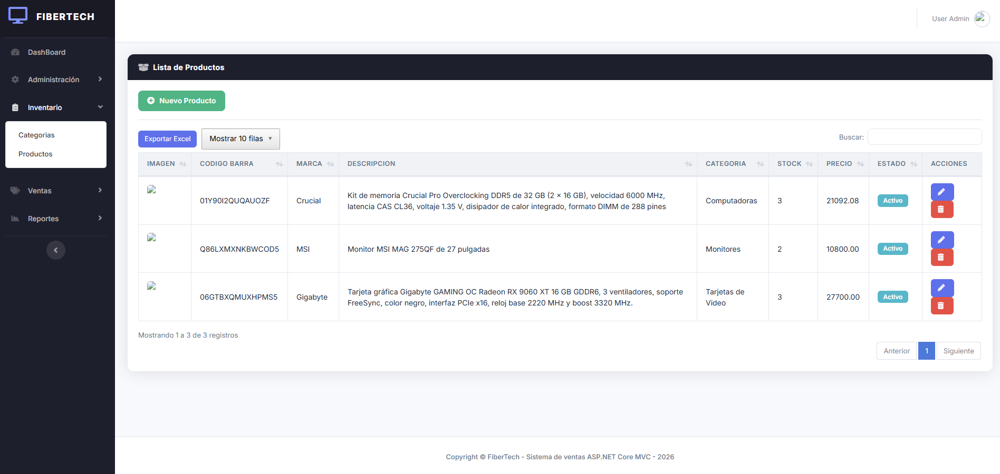
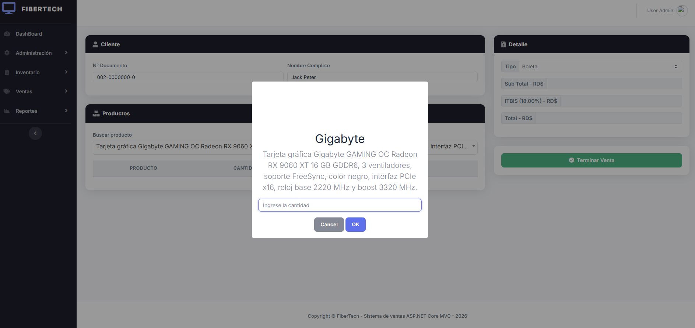
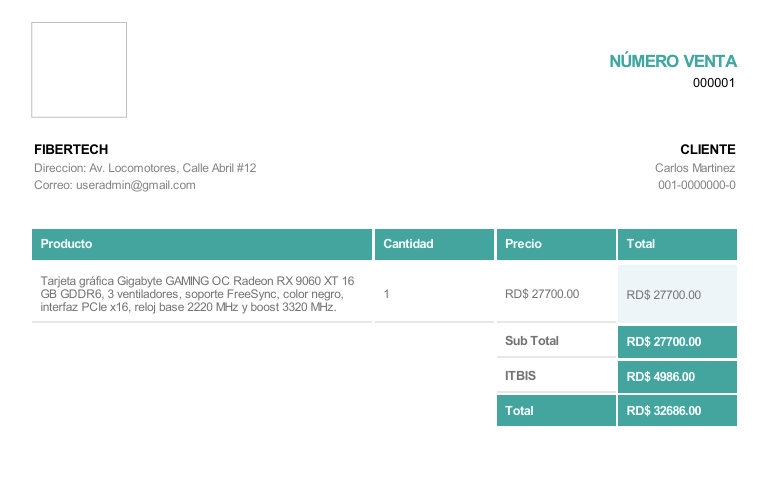
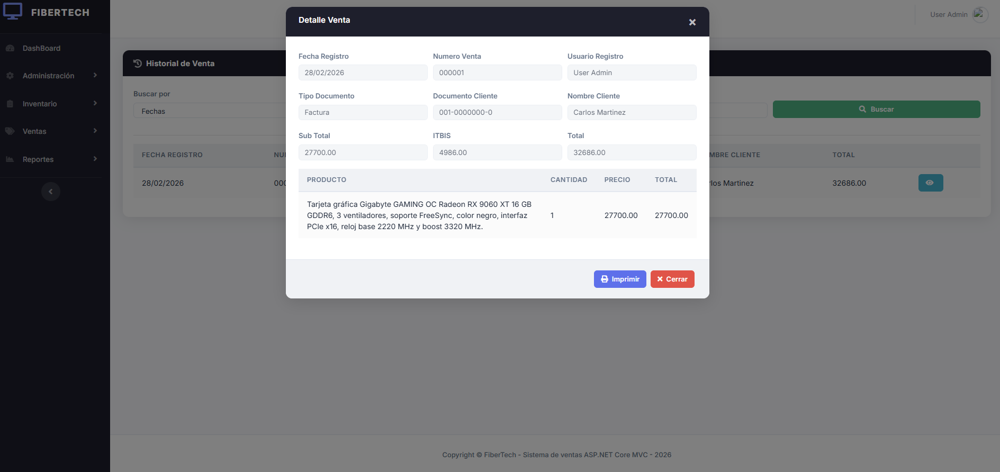

# 🛒 Sistema de Ventas WEB — ASP.NET Core MVC

> Aplicación Web Full-Stack para gestión de ventas, inventario y administración de negocio, migrado a **.NET 10** y con arquitectura en capas.

---

## 📸 Capturas de pantalla

### 🔐 Inicio de sesión

*Pantalla de login con validación de credenciales y opción de restablecimiento de clave por correo*

### 📊 Dashboard

*Panel principal con métricas de Total de Ventas, Ingresos, Productos y Categorías, más gráficos de los últimos 7 días y los 5 productos más vendidos*

### 🏢 Administración del Negocio

*Configuración general del negocio: razón social, dirección, correo, teléfono, símbolo de moneda, porcentaje de impuesto y logo*

### 📦 Gestión de Productos

*CRUD de productos con imagen, código de barras (generador automático), categoría, stock, precio y estado*

### 💰 Nueva Venta

*Formulario de venta con búsqueda de productos por nombre, cálculo automático de subtotal, impuesto y total*

### 🧾 Factura / Comprobante PDF

*Comprobante de venta generado en PDF con DinkToPdf a partir de una plantilla Razor*

### 📋 Historial de Ventas

*Búsqueda de ventas por rango de fechas o número de venta, con modal de detalle e impresión de comprobante*

---

## 📋 Descripción

Aplicación web para gestión de ventas, inventario y administración de negocio, desarrollada con **ASP.NET Core MVC (.NET 10)** y organizada en una arquitectura por capas:

| Capa | Proyecto |
|---|---|
| Presentación | `SistemaVenta.AplicacionWeb` |
| Lógica de negocio | `SistemaVenta.BLL` |
| Acceso a datos | `SistemaVenta.DAL` |
| Entidades de dominio | `SistemaVenta.Entity` |
| Inyección de dependencias | `SistemaVenta.IOC` |

El sistema usa autenticación por cookies, permisos por rol, generación de PDF para comprobantes, y carga de imágenes (usuarios, productos, logo) mediante Firebase Storage. Cuenta con un diseño moderno, completamente responsivo y consistente en todos los dispositivos (móvil, tablet y escritorio).

---

## ✨ Funcionalidades

- 🔐 **Autenticación y autorización** — login por cookies, vistas protegidas con `[Authorize]`, menú dinámico por rol
- 📊 **Dashboard** — indicadores de ventas, ingresos, productos y categorías con gráficos (Chart.js)
- 👥 **Gestión de usuarios** — altas, edición, cambio de estado y foto de perfil
- 🏢 **Gestión del negocio** — razón social, dirección, logo, símbolo de moneda e impuesto
- 📦 **Inventario** — categorías y productos con stock, precio, imagen y generador de código de barras
- 💰 **Ventas** — nueva venta con búsqueda de productos en tiempo real e historial con detalle por modal
- 🧾 **Comprobantes PDF** — generados con DinkToPdf sobre plantilla Razor, descargables e imprimibles
- 📈 **Reportes** — ventas por rango de fechas con exportación a Excel (DataTables Buttons)
- 📧 **Restablecimiento de clave** — envío de nueva clave por correo vía SMTP
- 📱 **Diseño responsivo** — sidebar colapsable en móvil, layouts adaptativos en todos los formularios y tablas

---

## 🏗️ Estructura de la solución

```text
SolucionSistemaVenta.sln
│
├─ SistemaVenta.AplicacionWeb/   → MVC: Controllers, Views, ViewModels, wwwroot
│   └─ public/                   → Capturas de pantalla del proyecto
├─ SistemaVenta.BLL/             → Servicios de lógica de negocio
├─ SistemaVenta.DAL/             → Repositorios + DBContext (EF Core)
├─ SistemaVenta.Entity/          → Entidades de dominio
├─ SistemaVenta.IOC/             → Registro de dependencias (DI)
└─ Recursos BD y Plantillas/     → Scripts SQL y plantillas de apoyo
```

---

## 🛠️ Stack tecnológico

### Backend
| Tecnología | Versión |
|---|---|
| .NET / ASP.NET Core MVC | 10.0 |
| Entity Framework Core (SQL Server) | 10.0.3 |
| AutoMapper | 13.0.1 |
| DinkToPdf | 1.0.8 |
| FirebaseAuthentication.net | 3.7.2 |
| FirebaseStorage.net | 1.0.3 |
| Newtonsoft.Json | 13.0.3 |

### Frontend
| Tecnología | Detalle |
|---|---|
| Razor Views | Layouts, ViewComponents, secciones parciales |
| Bootstrap 4.6 | Tema SB Admin 2 personalizado |
| CSS Custom Properties | Sistema de diseño propio en `OtrosEstilos.css` — paleta indigo/oscuro, Inter + Nunito |
| jQuery + jQuery UI | Interactividad y datepicker |
| DataTables | Extensiones Responsive y Buttons (Excel / Print) |
| Chart.js | Gráficos en el dashboard |
| Select2 | Dropdowns con búsqueda |
| Toastr / SweetAlert | Notificaciones y confirmaciones |
| Font Awesome 5 | Iconografía |

---

## 📋 Requisitos

- **.NET SDK 10.0+**
- **SQL Server** (Express / Developer / Standard)
- **Visual Studio 2022 v17.14+** o **VS Code**

---

## 🚀 Puesta en marcha

### 1) Clonar el repositorio

```bash
git clone https://github.com/xfiberex/SistemaVenta_ASP.NET_CORE_MVC.git
cd SistemaVenta_ASP.NET_CORE_MVC
```

### 2) Crear la base de datos

Ejecuta los scripts en orden desde SQL Server Management Studio o `sqlcmd`:

```
Recursos BD y Plantillas/Consultas/001_BaseDatos_Tablas.sql
Recursos BD y Plantillas/Consultas/002_Inserts.sql
```

> Los scripts crean la base de datos `DBVENTAWEB`, todas las tablas y los datos iniciales necesarios.

### 3) Configurar la cadena de conexión

Edita `SistemaVenta.AplicacionWeb/appsettings.json`:

```json
{
  "ConnectionStrings": {
    "CadenaSQL": "Server=TU_SERVIDOR;Database=DBVENTAWEB;Trusted_Connection=True;TrustServerCertificate=True;"
  }
}
```

### 4) Configurar servicios externos *(opcional pero recomendado)*

Las credenciales se gestionan desde la tabla `Configuracion` en la base de datos:

| Recurso | Campos requeridos |
|---|---|
| `FireBase_Storage` | email, clave, ruta, api_key, carpetas de imágenes |
| `Servicio_Correo` | correo, clave de app, alias, host SMTP, puerto |

> El script `002_Inserts.sql` inserta las claves con valores vacíos. Completa los valores para habilitar subida de imágenes y envío de correos.

### 5) Restaurar dependencias y ejecutar

```bash
dotnet restore
dotnet run --project SistemaVenta.AplicacionWeb
```

| | |
|---|---|
| **URL por defecto** | `http://localhost:5152` |
| **Ruta inicial** | `/Acceso/Login` |

---

## 🔐 Seguridad y acceso

- Autenticación mediante **Cookie Authentication**
- Sesión con expiración de **20 minutos**
- Menú dinámico filtrado por rol (`Rol` → `RolMenu` → `Menu`)
- Todas las rutas protegidas con `[Authorize]`

---

## 🧾 Base de datos

| Módulo | Tablas |
|---|---|
| Acceso | `Usuario`, `Rol`, `Menu`, `RolMenu` |
| Inventario | `Categoria`, `Producto` |
| Ventas | `Venta`, `DetalleVenta`, `TipoDocumentoVenta`, `NumeroCorrelativo` |
| Configuración | `Negocio`, `Configuracion` |

---

## 🎨 Diseño e interfaz

El frontend fue rediseñado desde cero sobre Bootstrap 4 con un sistema de estilos propio:

- **Sidebar oscuro** (`#1e1e2d`) con indicador de ítem activo y colapso de submenús
- **Mobile overlay** — sidebar oculto por defecto en móvil, se despliega como overlay con fondo desvanecido al pulsar el botón hamburguesa
- **Tarjetas del dashboard** con bordes de acento de color (azul, verde, teal, amarillo)
- **Cabeceras de card** oscuras y consistentes en todas las vistas del sistema
- **Tablas** envueltas en `table-responsive` con paginación, búsqueda y exportación
- **Formularios adaptativos** con columnas `col-lg-*` / `col-md-*` / `col-12` para cada breakpoint
- **Generador de código de barras** — produce códigos de 15 caracteres alfanuméricos en mayúsculas directamente en el modal de producto

---

## 🤝 Contribuciones

Las contribuciones son bienvenidas:

1. Haz un fork del proyecto
2. Crea una rama: `git checkout -b feature/mi-feature`
3. Realiza tus cambios y haz commit
4. Publica tu rama y abre un Pull Request

---

## 📄 Licencia

Distribuido bajo licencia **MIT**. Consulta [LICENSE.txt](LICENSE.txt) para más detalles.

---

## 👨‍💻 Autor

**xfiberex** — [@xfiberex](https://github.com/xfiberex)

---

## 📞 Soporte

¿Encontraste un problema o tienes dudas?

1. Revisa la documentación del repositorio
2. Busca en los [Issues existentes](https://github.com/xfiberex/SistemaVenta_ASP.NET_CORE_MVC/issues)
3. Abre un nuevo Issue con el detalle del problema

---

⭐ Si este proyecto te fue útil, considera darle una estrella en GitHub.